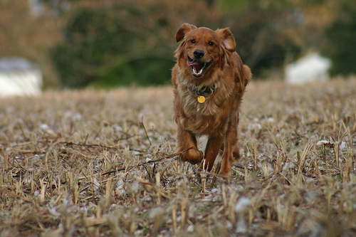

# Image Caption Generator

An end-to-end deep learning pipeline that generates natural language descriptions for images using CNN feature extraction, LSTM sequence modeling, Bahdanau Attention, and Beam Search decoding.

This project includes a Streamlit web app for real-time caption generation, attention heatmap visualization, and BLEU score evaluation using reference captions.

This is my first deep learning project where I tried building an image captioning system from scratch using neural networks and deployed it with Streamlit.

---

# Overview

This project generates captions for images by combining:

- **ResNet50** - transfer learning for spatial feature extraction
- **LSTM** - sequential word generation
- **Bahdanau Attention** - focuses on important image regions dynamically
- **Beam Search** - improves caption quality over greedy decoding
- **Attention Heatmap** - visualizes image regions focused on during caption generation
- **BLEU Score Evaluation** - compares generated captions with reference captions
- **Streamlit** - interactive web app for real-time inference

---

# Demo

Upload an image in the Streamlit and the model generates a caption instantly.

## Sample

Caption Generator Image:



Generated Caption:

```text
dog is running on the grass
```
Attention Heatmap Image:


BLEU Score Image:


---

# Dataset

- Flickr8k Dataset (Kaggle / University of Illinois)
- ~8,000 images
- 5 captions per image

---

# Project Structure

```text
Image-Caption-Generator-DL/
│
├── data/                           # ignored in git
│   ├── Images/
│   └── captions.txt
│
├── saved_models/                   # ignored in git
│   ├── tokenizer.pkl
│   ├── attention_features.pkl
│   ├── best_attention_model.keras
│   └── attention_model.keras
│
├── assets/
│   ├── caption_generator.png
│   ├── attention_heatmap.png
│   └── bleu_score.png
│
├── src/
│   ├── preprocessing/
│   │   ├── text_preprocessing.py
│   │   └── extract_attention_features.py
│   │
│   ├── models/
│   │   └── caption_model.py
│   │
│   ├── training/
│   │   └── train_attention.py
│   │
│   ├── inference/
│   │   └── generate_caption.py
│   │
│   └── evaluation/
│       └── evaluate.py
│
├── notebooks/
│   ├── data_understanding.ipynb
│   └── feature_extraction.ipynb
│
├── app.py
├── check_dataset.py
├── config.py
├── requirements.txt
├── .gitignore
└── README.md
```

---

# Running the Pipeline

Run the following steps in order.

---

## Step 1 — Install Dependencies

```bash
pip install -r requirements.txt
```

---

## Step 2 — Verify Dataset

```bash
python check_dataset.py
```

---

## Step 3 — Preprocess Captions and Build Tokenizer

```bash
python src/preprocessing/text_preprocessing.py
```

### Output

```text
saved_models/tokenizer.pkl
```

---

## Step 4 — Extract Spatial Attention Features

```bash
python src/preprocessing/extract_attention_features.py
```

### Output

```text
saved_models/attention_features.pkl
```

Each image is stored as:

```text
(49, 2048)
```

These are spatial features extracted from the final convolutional block of ResNet50.

---

## Step 5 — Train the Attention Model

```bash
python -m src.training.train_attention
```

### Outputs

```text
saved_models/best_attention_model.keras
saved_models/attention_model.keras
```

---

## Step 6 — Evaluate the Model

### Beam Search Evaluation

```bash
python -m src.evaluation.evaluate
```

### Evaluate on 100 Images

```bash
python -m src.evaluation.evaluate --num_samples 100
```

### Greedy Decoding

```bash
python -m src.evaluation.evaluate --beam_width 1
```

---

## Step 7 — Generate Caption for a Single Image

```bash
python -m src.inference.generate_caption path/to/image.jpg
```

### Beam Search Width = 3

```bash
python -m src.inference.generate_caption path/to/image.jpg --beam_width 3
```

---

## Step 8 — Launch Streamlit App

```bash
streamlit run app.py
```

---

# Model Architecture

## Transfer Learning — ResNet50

A pretrained **ResNet50** model trained on ImageNet is used as a frozen feature extractor.

The convolutional layers are NOT fine-tuned.

Instead of using the final pooled vector, the project extracts spatial features from the last convolutional block:

```text
Input Image (224, 224, 3)
            ↓
Frozen ResNet50
            ↓
Output: (7, 7, 2048)
            ↓
Reshape → (49, 2048)
```

This gives 49 regional feature vectors representing different spatial regions of the image.

These spatial vectors are required for attention.

---

# Why No Fine-Tuning?

The ResNet50 backbone is frozen because:

- Flickr8k is a relatively small dataset
- Fine-tuning large CNNs can easily overfit
- Transfer learning already provides strong visual representations
- Training becomes much faster and memory efficient

The project focuses mainly on improving the decoder and attention mechanism.

---

# Caption Generation Pipeline

```text
Image
  ↓
ResNet50 Feature Extraction
  ↓
Spatial Features (49, 2048)
  ↓
Bahdanau Attention
  ↓
LSTM Decoder
  ↓
Beam Search Decoding
  ↓
Generated Caption

Streamlit app also includes:

Generated Caption + Attention Weights
  ↓
Attention Heatmap Visualization

Generated Caption + Reference Caption
  ↓
BLEU Score Evaluation
```

---

# Attention-Based Caption Model

```text
Image Features (49, 2048)          Partial Caption
            ↓                              ↓
    Dense(256, relu)          Embedding(vocab_size, 256)
            ↓                              ↓
       Dropout(0.4)                 Dropout(0.4)
            ↓                              ↓
            └────────────→ LSTM(256, return_state=True)
                                      ↓
                              Hidden State
                                      ↓
                       Bahdanau Attention Layer
                                      ↓
                             Context Vector
                                      ↓
                    Concatenate(Context + LSTM Output)
                                      ↓
                              Dense(256, relu)
                                      ↓
                        Dense(vocab_size, softmax)
```

---

# Bahdanau Attention

At every decoding step, the model learns where to focus in the image before predicting the next word.

```text
score   = V(tanh(W1(features) + W2(hidden_state)))
weights = softmax(score)
context = Σ(weights × features)
```

This allows the model to dynamically attend to different image regions while generating captions.

Example:

- generating "dog" → focuses on dog region
- generating "grass" → shifts attention to ground region

---

# Beam Search

Instead of selecting only the highest probability word at each step, beam search keeps multiple candidate captions.

## Greedy Decoding

```bash
--beam_width 1
```

Fast but less accurate.

## Beam Search

```bash
--beam_width 3
```

Recommended balance between quality and speed.

## Wider Beam

```bash
--beam_width 5
```

Better captions but slower inference.

---

# Training Details

| Parameter | Value |
|---|---|
| Optimizer | Adam |
| Loss Function | Categorical Crossentropy |
| Batch Size | 32 |
| Epochs | 20 with Early Stopping |
| Embedding Size | 256 |
| LSTM Units | 256 |
| Attention Units | 256 |
| Dropout | 0.4 |
| Train / Validation Split | 80 / 20 |

Training uses Python generators to avoid loading all sequence pairs into RAM simultaneously.

This significantly reduces memory usage because the dataset creates nearly 300,000 training sequences.

---

# Example Results

| Metric | Score |
|---|---|
| BLEU-1 | 0.2200 |
| BLEU-2 | 0.1122 |
| BLEU-3 | 0.0545 |
| BLEU-4 | 0.0238 |

---

# Evaluation Metrics

- **BLEU-1** → unigram precision
- **BLEU-2** → bigram precision
- **BLEU-3** → 3-gram precision
- **BLEU-4** → full sentence quality

Evaluation is performed only on the held-out test split.

---

# Features Implemented

- CNN + LSTM image captioning
- Transfer learning with ResNet50
- Spatial attention mechanism
- Bahdanau Attention
- Attention heatmap visualization
- Beam search decoding
- Greedy decoding
- BLEU score evaluation
- BLEU score calculation in Streamlit using reference captions
- Early stopping
- Learning rate scheduling
- Streamlit deployment
- Generator-based memory efficient training

---

# Known Limitations

- The model is trained on the small Flickr8k dataset.
- It may generate incorrect captions for complex or unfamiliar images.
- Vocabulary is limited to Flickr8k
- Captions may become repetitive on unseen domains
- Performance drops on highly complex scenes
- ResNet50 backbone is frozen
- Beam search may not always perform better than greedy decoding for this trained model.
- BLEU scores are relatively low because Flickr8k is small
- BLEU score needs a correct reference caption for comparison.

---

# Future Improvements

- Transformer decoder architecture
- Fine-tuning top ResNet layers
- Training on Flickr30k or MS-COCO
- CIDEr / METEOR evaluation metrics
- CLIP-based image embeddings
- Multi-head attention decoder

